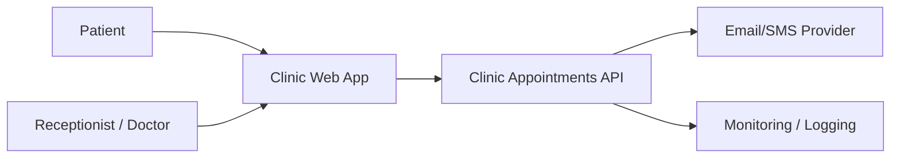
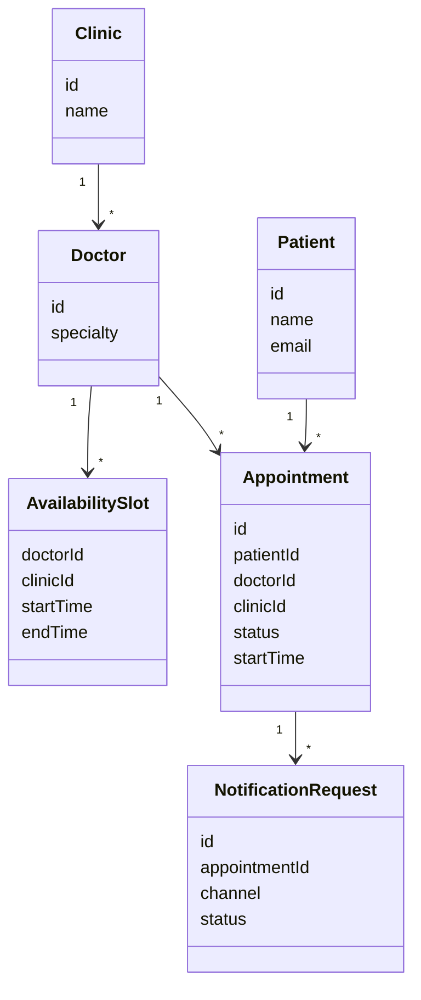
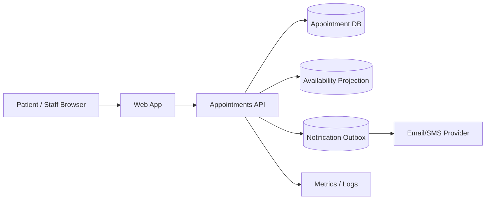
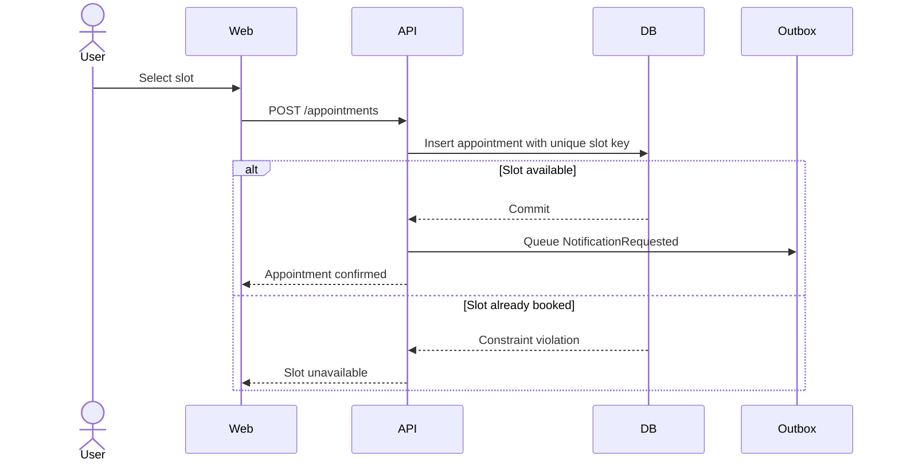

# Clinic Appointments - Architecture Document

Status: Approved
Generated by: SAM agent
Approved by: Example architect
Approved date: Example snapshot
Rigor profile: Standard
System context: Greenfield
Source artifacts:
- `example input` @ repository snapshot

## 1. Purpose, Audiences And Uses

The Clinic Appointments system allows patients, receptionists and doctors to manage appointments across clinics. The initial architecture optimizes for MVP delivery, no double-booking, fast availability search and patient-data protection.

## 2. System Context And Scope

## 3. Architectural Drivers And Scenarios

| Driver | Priority | Design response |
| --- | --- | --- |
| QA-001 Consistency | Primary | Transactional booking and unique slot constraint. |
| QA-002 Performance | Primary | Read-optimized availability projection. |
| QA-004 Security/privacy | Primary | API authorization and audit logging. |
| QA-003 Availability | Supporting | Simple cloud deployment and observable booking path. |
| QA-005 Monitorability | Supporting | Metrics/logging for booking and notifications. |
| QA-006 Modifiability | Supporting | Modular monolith boundaries. |

## 4. View Selection

The architect selected context, domain, container, booking runtime, and event views for product, implementation, security, and operations questions. No separate deployment or class-detail view is required for this MVP.

## 5. Architecture Views

The following domain, container, sequence, and event sections form the selected view set. Their labels and arrows use the Mermaid notation shown in each diagram.

## 4. Domain Model

## 5. Container Diagram

## 6. Sequence Diagrams

### Book Appointment

## 7. Event Definitions

| Event | Producer | Consumer | Payload | Reliability |
| --- | --- | --- | --- | --- |
| AppointmentBooked | Appointments API | Availability projection | appointmentId, doctorId, clinicId, startTime | Transactional with booking. |
| NotificationRequested | Appointments API | Notification worker | appointmentId, channel, recipient | Stored in outbox and retried. |

## 8. Architectural Decisions

| ID | Driver | Decision | Rationale | Discarded alternatives | Consequences |
| --- | --- | --- | --- | --- | --- |
| ADR-001 | CON-002, QA-006 | Use a modular monolith. | Small team and short MVP timeline. | Microservices. | Module boundaries need code review. |
| ADR-002 | QA-001 | Use unique slot constraint in transactional booking. | Simplest reliable double-booking protection. | Distributed lock. | Slot key must be carefully defined. |
| ADR-003 | QA-002 | Use availability projection. | Fast search without overloading writes. | Raw table scans. | Projection freshness must be monitored. |
| ADR-004 | QA-004 | Enforce API authorization and audit logging. | Protects patient data at trust boundary. | UI-only authorization. | Requires role matrix and audit storage. |
| ADR-005 | QA-005 | Use notification outbox. | Provider failures do not break booking. | Synchronous provider call. | Requires retry and alerting. |

## 9. Interfaces And Runtime Behavior

| Interface | Type | Purpose |
| --- | --- | --- |
| `GET /availability` | REST query | Search available appointment slots. |
| `POST /appointments` | REST command | Book appointment. |
| `PATCH /appointments/{id}` | REST command | Reschedule or cancel appointment. |
| `GET /doctor-schedule` | REST query | Show daily doctor schedule. |

## 10. Delivery Guidance

| Epic/Story | Driver or decision | Acceptance criteria | Architecture check |
| --- | --- | --- | --- |
| Book appointment | QA-001, ADR-002 | Same slot cannot be confirmed twice. | DB has unique slot key. |
| Search availability | QA-002, ADR-003 | P95 response under 1 second for expected load. | Query uses projection. |
| Secure patient access | QA-004, ADR-004 | Users cannot access other patient records. | API authorization tests pass. |
| Notification request | QA-005, ADR-005 | Booking succeeds when provider is down. | Request stored in outbox. |

## 11. Traceability Summary

| Requirement | Scenario | Driver | Decision | View/diagram | Epic/Story | Check |
| --- | --- | --- | --- | --- | --- | --- |
| REQ-003 | QA-001 | Consistency | ADR-002 | Book Appointment sequence | Book appointment | Unique slot key. |
| REQ-002 | QA-002 | Performance | ADR-003 | Container | Search availability | Projection used. |
| REQ-001 | QA-004 | Security/privacy | ADR-004 | Context/Container | Secure patient access | API auth tests. |
| REQ-007 | QA-005 | Monitorability | ADR-005 | Event definitions | Notification request | Outbox retry/alerts. |

## 12. Governance And Agent Guidance

- Critical stories link to at least one driver or decision.
- Booking code must use transactional unique slot constraint.
- Availability search must use projection, not raw scans.
- Patient data access must be authorized in the API.
- Notification provider calls must not run inside the booking transaction.

## 13. Traceability And Evidence

| Requirement | Scenario | Driver | Decision | Story | Check | Evidence status |
| --- | --- | --- | --- | --- | --- | --- |
| REQ-003 | QA-001 | DRV-001 | ADR-002 | STORY-001 | CHECK-001 | Pending |
| REQ-002 | QA-002 | DRV-002 | ADR-003 | STORY-002 | CHECK-002 | Pending |
| REQ-001 | QA-004 | DRV-003 | ADR-004 | STORY-003 | CHECK-003 | Pending |

## 14. Quality, Security, Data And Operations

Patient and appointment data are confidential. Browser/API and API/identity-provider boundaries require authenticated, authorized calls and audited access; the Standard-profile threat review focuses on broken object authorization and sensitive-data exposure.

## 15. Operations And Evolution

Availability and performance measures become SLI/SLO checks. Deployments require reversible database migrations; load changes, privacy incidents, regulation changes, technology replacement, or failed checks trigger ADR review and architecture-code drift review.

## 16. Risks, Assumptions And Technical Debt

The external notification provider, slot identity rules, and availability projection freshness remain review triggers owned by the architect.

## 17. Exit Checklist

- [x] Approved provisional views are consolidated and answer implementation questions.
- [x] Primary drivers reach ADRs, stable stories, checks, and evidence status.
- [x] Standard-profile security, operations, recovery, and evolution concerns are covered.
