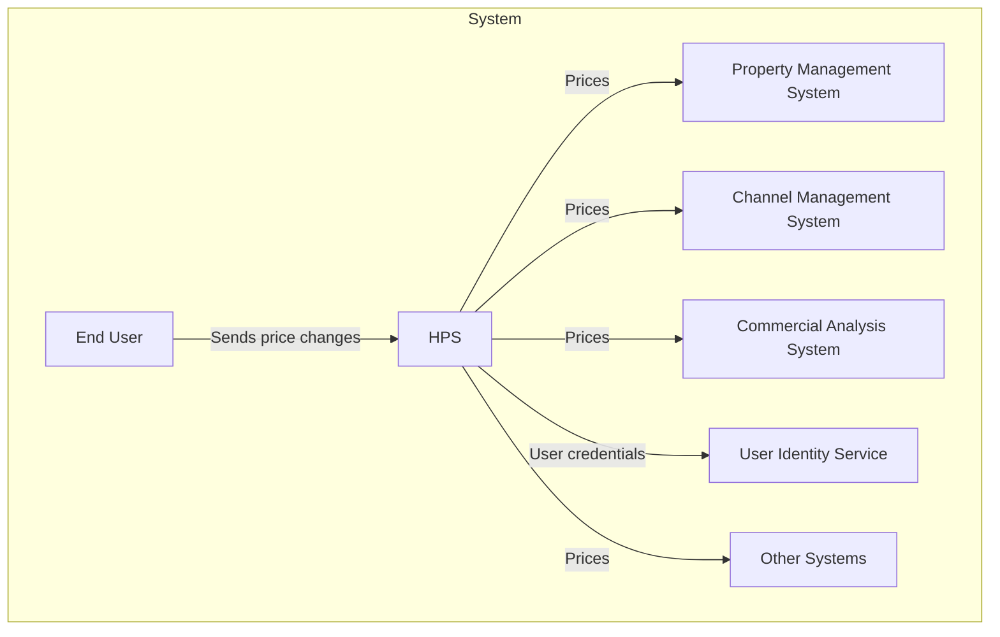

# Hotel Pricing System - Architectural Requirements

Status: Approved
Generated by: SAM agent
Approved by: Example architect
Approved date: Example snapshot
Rigor profile: Standard
System context: Evolution
Source artifacts:
- `example input` @ repository snapshot

Generated by agent, reviewed/approved by architect.

## Business Context

AD&D Hotels is a mid-sized business hotel chain (currently around 300 hotels) which has been experiencing robust growth in recent years. The IT infrastructure of the company is composed of many different applications such as a Property Management System, a Commercial Analysis System, an Enterprise Reservation System, a Channel Management System and, at the center of this system of systems, is the Hotel Pricing System, as seen in the following context diagram:

> Context diagram for the Hotel Pricing System

The Hotel Pricing System (HPS) is used by sales managers and commercial representatives to establish prices for rooms at specific dates for the different hotels in the company. Prices are associated with different rates (for example a public rate, or a discount rate) and most of the prices for the different rates are calculated by taking a base rate and applying business rules to it (although some of the rates can also be fixed and not depend on the base rate). Managers typically change prices of the base and fixed rates, and using this information, the Hotel Pricing System calculates the prices of all the rates for all rooms in all hotels which also vary according to the types of rooms available in each hotel. Prices that are calculated by the HPS are used by other systems in the company to make reservations and they are also sent to different online travel agencies through the Channel Management System (CMS). The company’s systems are hosted with a cloud provider which offers a user identity service that manages users and provides Single Sign On functionalities.

AD&D Hotels wants to modernize its IT infrastructure, the first step being the complete replacement of the existing pricing system which was developed several years ago and is suffering from reliability, performance, availability and maintainability issues, and this has resulted in financial losses. Furthermore, the company has experienced difficulties because many of its systems are connected using traditional SOAP and REST request-response endpoints: changes to one application frequently impact other applications and complicate the deployment of individual updates to specific applications. Also, the failure of a particular application can propagate through the entire system. Furthermore, some of the applications interact using what are now well-known anti-patterns such as integration through a shared database. Recently revised Enterprise Architecture principles within the organization are mandating a migration of the system toward a more decoupled model.  

As part of the modernization effort, AD&D hotels also wants to integrate Agile (specifically Scrum) and DevOps practices in the development of the Hotel Pricing System. Artifacts in the development process move through four different environments:

- Development: This is a local environment on the developers’ computers
- Integration: This is an environment in the cloud where an integrated version of the HPS is tested. In this environment, the system is not connected with all of the external systems and so some of these external systems are substituted by mocks.
- Staging: This is an environment in the cloud where the system’s final tests (including load testing) are performed prior to deployment. Here the system is connected to test versions of all the external systems. At the end of a sprint, the system is typically demonstrated from this environment.
- Production: This is the real-world execution environment.

## System Requirements

Requirement elicitation activities had been previously performed, and the following is a summary of the most important requirements collected.

### Primary functionality

The Hotel Pricing System’s functionality is conceptually simple; the main user stories for the system are shown using a Use Case diagram in Figure 8.2.

Figure 8.2: Initial Use Case Diagram for the Hotel Pricing System

Each of these user stories is described in the following table:

| User story           | Description                                                                                                                                                                                                                                                                                                                                                                                                                                                                                                               |
| -------------------- | ------------------------------------------------------------------------------------------------------------------------------------------------------------------------------------------------------------------------------------------------------------------------------------------------------------------------------------------------------------------------------------------------------------------------------------------------------------------------------------------------------------------------- |
| REQ-001: Log In        | A user (commercial or administrator) provides their credentials in a login window. The system checks these credentials against a user identity service and, if successful, provides access to the system. Once logged in, a user can only make queries and changes to the hotels for which they have been authorized.                                                                                                                                                                                                     |
| REQ-002: Change Prices | A user selects a specific hotel for which they are authorized to change prices and selects particular dates where they want to make price changes either to a base rate or a fixed rate. All of the prices for the rates that are calculated from the base rate are calculated at that point. The system allows price changes to be simulated before they are actually changed. When the prices are changed, they are pushed to the Channel Management System and they become available for querying by external systems. |
| REQ-003: Query Prices  | A user or an external system queries prices for a given hotel through the user interface or a query API.                                                                                                                                                                                                                                                                                                                                                                                                                  |
| REQ-004: Manage Hotels | An administrator adds, changes or modifies hotel information. This includes editing the hotel’s tax rates, available rates, and room types.                                                                                                                                                                                                                                                                                                                                                                               |
| REQ-005: Manage Rates  | An administrator adds, changes or modifies rates. This includes defining the calculation business rules for the different rates.                                                                                                                                                                                                                                                                                                                                                                                          |
| REQ-006: Manage Users  | An administrator changes permissions for a given user.                                                                                                                                                                                                                                                                                                                                                                                                                                                                    |

### Quality attribute scenarios

In addition to the above use cases, a number of quality attribute scenarios were elicited and documented. Before ADD, each scenario should be decomposed into source of stimulus, stimulus, artifact, environment, response, and response measure. The most relevant ones are presented in the following table. For each scenario we also identify the user story that it is associated with.

| ID   | Quality Attribute | Scenario                                                                                                                                                                                                                        | Associated User story |
| ---- | ----------------- | ------------------------------------------------------------------------------------------------------------------------------------------------------------------------------------------------------------------------------- | --------------------- |
| QA-001 | Performance       | A base rate price is changed for a specific hotel and date during normal operation, the prices for all the rates and room types for the hotel are published (ready for query) in less than 100 ms.                              | REQ-002                 |
| QA-002 | Reliability       | A user performs multiple price changes on a given hotel. 100% of the price changes are published (available for query) successfully and they are also received by the channel management system.                                | REQ-002                 |
| QA-003 | Availability      | Pricing queries uptime SLA must be 99.9% outside of maintenance windows.                                                                                                                                                        | All                   |
| QA-004 | Scalability       | The system will initially support a minimum of 100,000 price queries per day through its API and should be capable of handling up to 1,000,000 without decreasing average latency by more than 20%.                             | REQ-003                 |
| QA-005 | Security          | A user logs into the system through the front-end. The credentials of the user are validated against the User Identity Service and, once logged in, they are presented with only the functions that they are authorized to use. | All                   |
| QA-006 | Modifiability     | Support for a price query endpoint with a different protocol than REST (e.g. gRPC) is added to the system. The new endpoint does not require changes to be made to the core components of the system.                           | All                   |
| QA-009 | Testability       | 100% of the system and its elements should support integration testing independently of the external systems                                                                                                                    | All                   |
| QA-007 | Deployability     | The application is moved between non production environments as part of the development process. No changes in the code are needed.                                                                                             | All                   |
| QA-008 | Monitorability    | A system operator wishes to measure the performance and reliability of price publication during operation. The system provides a mechanism that allows 100% of these measures to be collected as needed.                        | REQ-002                 |

### Constraints

Finally, a set of constraints on the system and its implementation were collected. These are presented in the following table.

| ID    | Constraint                                                                                                                                                                     |
| ----- | ------------------------------------------------------------------------------------------------------------------------------------------------------------------------------ |
| CON-001 | Users must interact with the system through a web browser in different platforms Windows, OSX, and Linux, and different devices.                                               |
| CON-002 | Manage users through cloud provider identity service and host resources in the cloud.                                                                                          |
| CON-003 | Code must be hosted on a proprietary Git-based platform that is already in use by other projects in the company                                                                |
| CON-004 | The initial release of the system must be delivered in 6 months, but an initial version of the system (MVP) must be demonstrated to internal stakeholders in at most 2 months. |
| CON-005 | The system must interact initially with existing systems through REST APIs but may need to later support other protocols.                                                      |
| CON-006 | A cloud-native approach should be favored when designing the system.                                                                                                           |

### Architectural concerns

Since this is greenfield development, only a few general concerns were identified initially and these are shown in the following table.

| ID    | Concern                                                                          |
| ----- | -------------------------------------------------------------------------------- |
| CON-101 | Establish an overall initial system structure.                                   |
| CON-102 | Leverage the team’s knowledge about Java technologies and the Angular framework. |
| CON-103 | Allocate work to members of the development team.                                |
| CON-104 | Avoid introducing technical debt                                                 |
| CON-105 | Set up a continuous deployment infrastructure.                                   |

## Priorities

The primary user stories were determined to be:

- REQ-002: Change Prices \- Because it directly supports the core business
- REQ-003: Query Prices \- Because it directly supports the core business
- REQ-004: Manage Hotels \- Because it establishes a basis for many other user stories

The scenarios for the HPS have been prioritized as follows:

| Scenario ID            | Importance to the customer | Difficulty of implementation according to the architect |
| :--------------------- | :------------------------- | :------------------------------------------------------ |
| QA-001 \- Performance    | High                       | High                                                    |
| QA-002 \- Reliability    | High                       | High                                                    |
| QA-003 \- Availability   | High                       | High                                                    |
| QA-004 \- Scalability    | High                       | High                                                    |
| QA-005 \- Security       | High                       | Medium                                                  |
| QA-006 \- Modifiability  | Medium                     | Medium                                                  |
| QA-007 \- Deployability  | Medium                     | Medium                                                  |
| QA-008 \- Monitorability | Medium                     | Medium                                                  |
| QA-009 \- Testability    | Medium                     | Medium                                                  |

From this list, QA-001, QA-002, QA-003, QA-004 and QA-005 are selected as primary drivers.

## Phase 1 - Architectural Requirements Execution

### Intake Summary

| Item | Result |
| --- | --- |
| Business goal | Replace the legacy Hotel Pricing System to reduce financial loss and support infrastructure modernization. |
| Main users | Sales managers, commercial representatives, administrators, external systems. |
| System boundary | HPS owns price calculation, price changes, price queries, hotel/rate administration, and publication of prices. |
| Key external systems | User Identity Service, Channel Management System, Property Management System, Commercial Analysis System, other consumers. |
| Delivery pressure | MVP demonstration in 2 months and initial release in 6 months. |
| Technical direction | Cloud-hosted, browser-based, Java/Angular-friendly, decoupled integration, DevOps/Scrum. |

### ASR Classification

| ID | Type | Description | Architectural impact |
| --- | --- | --- | --- |
| REQ-002 | Functional key | Change prices, calculate derived prices, publish results. | Defines the core write flow and consistency boundary. |
| REQ-003 | Functional key | Query prices through UI/API. | Defines read model, availability and scale needs. |
| REQ-004 | Functional key | Manage hotels, taxes, rates and room types. | Defines domain model and admin module boundaries. |
| QA-001 | Quality attribute | Price publication in less than 100 ms. | Requires efficient calculation and publication path. |
| QA-002 | Quality attribute | 100% of price changes are queryable and received by CMS. | Requires reliable persistence and integration. |
| QA-003 | Quality attribute | 99.9% query uptime outside maintenance. | Requires resilient query path. |
| QA-004 | Quality attribute | Query volume grows from 100k/day to 1M/day. | Requires scalable read path. |
| QA-005 | Quality attribute | Authenticated users see only authorized functions/hotels. | Requires identity integration and authorization model. |
| QA-006 | Quality attribute | Add non-REST query protocol without core changes. | Requires protocol adapters around core pricing/query logic. |
| QA-007 | Quality attribute | Move between environments without code changes. | Requires externalized config and deployment automation. |
| QA-008 | Quality attribute | Operators measure publication performance/reliability. | Requires metrics and tracing around publication. |
| QA-009 | Quality attribute | Integration tests run without external systems. | Requires ports/adapters and mocks/test doubles. |
| CON-001..6 | Constraints | Browser UI, cloud identity/hosting, Git platform, deadlines, REST first, cloud-native. | Constrains technology and delivery choices. |

### Quality Attribute Scenarios

| ID | Attribute | Source | Stimulus | Artifact | Environment | Response | Measure |
| --- | --- | --- | --- | --- | --- | --- | --- |
| QA-001 | Performance | Authorized business user | Changes a base or fixed rate for one hotel/date. | Pricing command flow and calculation component. | Normal operation. | Derived prices are calculated and made queryable. | Prices published for all room/rate combinations in less than 100 ms. |
| QA-002 | Reliability | Authorized business user | Performs multiple price changes for a hotel. | Pricing database, outbox, publication flow, CMS integration. | Normal operation with possible transient integration failures. | Changes are persisted, queryable, and delivered to CMS with retry. | 100% of accepted changes become queryable and are received by CMS. |
| QA-003 | Availability | UI user or external system | Sends price query. | Query API and read model. | Outside maintenance windows. | Query path remains available through instance failure or scaling event. | 99.9% uptime. |
| QA-004 | Scalability | External systems and UI users | Query volume increases. | Query API and read store/cache. | Daily production load. | Query path scales without changing core pricing logic. | 100k/day initially, 1M/day with less than 20% average latency degradation. |
| QA-005 | Security | User logging in | Presents credentials and requests functions/hotels. | Web UI, API, identity adapter, authorization rules. | Normal operation. | User is authenticated and limited to authorized capabilities. | Unauthorized functions and hotels are not visible or executable. |
| QA-006 | Modifiability | Architect/developer | Adds a gRPC price query endpoint. | Query adapter and core query service. | Planned enhancement. | New protocol delegates to existing core query use case. | No changes to core pricing/query components. |
| QA-007 | Deployability | Delivery team | Promotes app across environments. | Deployment config and runtime services. | Dev, integration, staging, production. | Environment changes are handled by config. | No code changes between environments. |
| QA-008 | Monitorability | Operator | Needs publication performance and reliability data. | Metrics/logging/tracing pipeline. | Production operation. | System exposes publication metrics and failures. | 100% of publication attempts are measurable. |
| QA-009 | Testability | Development team | Runs integration tests without real external systems. | External system adapters and test doubles. | CI/integration environment. | External dependencies can be mocked. | 100% of elements support integration testing independent of external systems. |

### Utility Tree

| Driver | Business importance | Technical difficulty | Risk | Priority |
| --- | --- | --- | --- | --- |
| QA-001 Performance | High | High | High | Primary |
| QA-002 Reliability | High | High | High | Primary |
| QA-003 Availability | High | High | High | Primary |
| QA-004 Scalability | High | High | High | Primary |
| QA-005 Security | High | Medium | High | Primary |
| QA-008 Monitorability | Medium | Medium | Medium | Supporting |
| QA-006 Modifiability | Medium | Medium | Medium | Supporting |
| QA-007 Deployability | Medium | Medium | Medium | Supporting |
| QA-009 Testability | Medium | Medium | Medium | Supporting |

### Driver Proposal

1. QA-001 Performance
2. QA-002 Reliability
3. QA-003 Availability
4. QA-004 Scalability
5. QA-005 Security

Supporting drivers: QA-006, QA-007, QA-008 and QA-009.

### Assumptions And Concerns

| ID | Assumption or concern | Impact if false | Owner | Resolution / accepted risk |
| --- | --- | --- | --- | --- |
| CON-201 | Managed identity, cloud hosting, and CMS APIs remain available. | Identity, deployment, and publication decisions must be revisited. | Architect | Validate contracts before production. |

### Open Questions And Risks

| Item | Owner | Effect | Resolution, due point, or accepted risk |
| --- | --- | --- | --- |
| CMS retry and retention limits | Architect | Reliability and storage policy | Resolve before production readiness review. |

### Driver ID Crosswalk

| Driver ID | Scenario | Priority |
| --- | --- | --- |
| DRV-001 | QA-001 Performance | Primary |
| DRV-002 | QA-002 Reliability | Primary |
| DRV-003 | QA-003 Availability | Primary |
| DRV-004 | QA-004 Scalability | Primary |
| DRV-005 | QA-005 Security | Primary |

### Exit Checklist

- [x] Inputs, Standard profile, stable IDs, and measurable primary drivers recorded.
- [x] Critical tradeoffs are represented in the approved driver list.
- [x] Example approval and source snapshot recorded.
