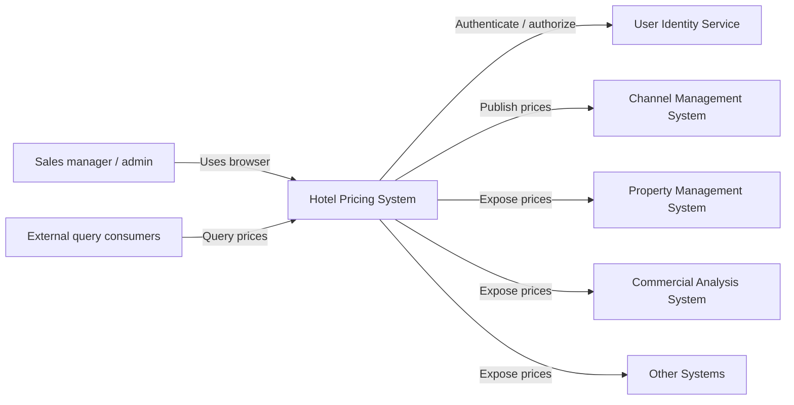
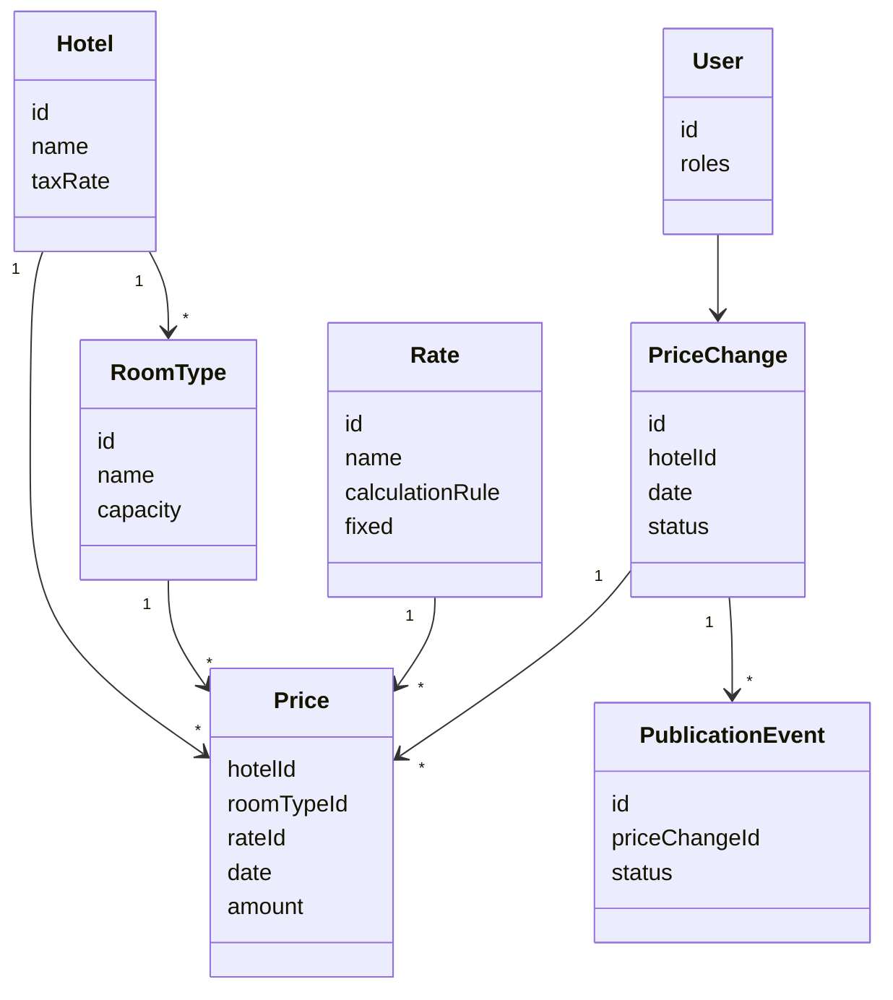
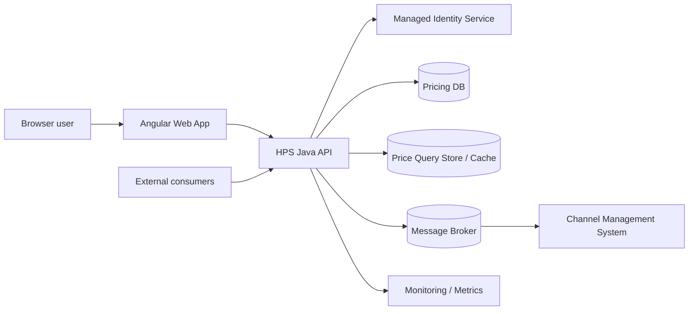
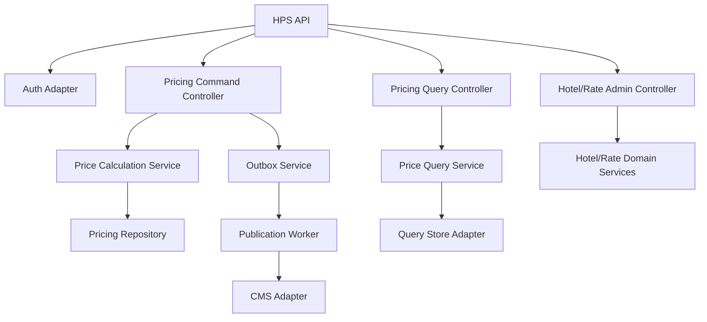
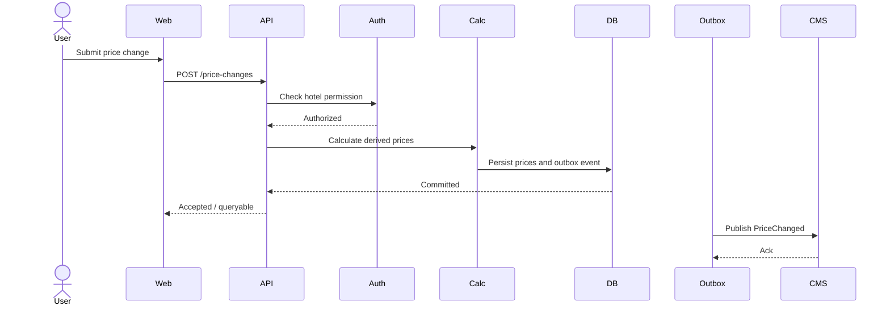
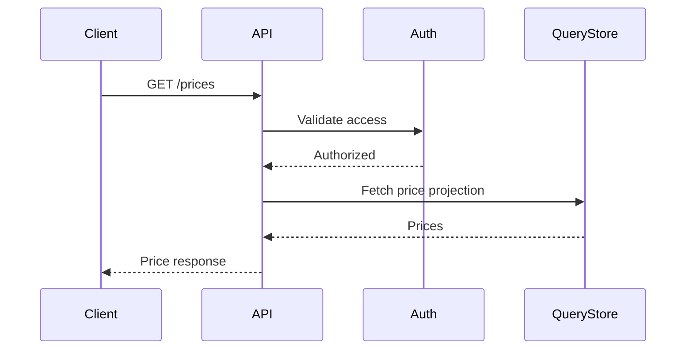

# Hotel Pricing System - Architecture Document

Status: Approved
Generated by: SAM agent
Approved by: Example architect
Approved date: Example snapshot
Tailoring profile: Standard
Source artifacts:
- `example input` @ repository snapshot

## 1. Introduction

The Hotel Pricing System (HPS) replaces the legacy pricing system for AD&D Hotels. It supports price changes, price calculation, price queries, hotel/rate administration, and publication of prices to external systems.

The initial architecture optimizes for fast MVP delivery while preserving control over core quality drivers: performance, reliability, availability, scalability and security.

## 2. Context Diagram

## 3. Architectural Drivers

| Driver | Source | Priority | Design response |
| --- | --- | --- | --- |
| QA-001 Performance | Price change publication under 100 ms. | Primary | Fast calculation path and read projection update. |
| QA-002 Reliability | 100% accepted changes queryable and received by CMS. | Primary | Transactional persistence plus outbox publication. |
| QA-003 Availability | 99.9% query uptime. | Primary | Isolated query path and scalable read store/cache. |
| QA-004 Scalability | 100k/day to 1M/day queries. | Primary | Read-optimized query model and horizontal API scaling. |
| QA-005 Security | Managed identity and hotel/function authorization. | Primary | OIDC identity integration and API authorization checks. |
| QA-006 Modifiability | Add gRPC query endpoint without core changes. | Supporting | Protocol adapters around core query use case. |
| QA-007 Deployability | Move between environments without code changes. | Supporting | Externalized config and containerized deployment. |
| QA-008 Monitorability | Measure publication performance/reliability. | Supporting | Metrics around command, outbox and publication flow. |
| QA-009 Testability | Test without external systems. | Supporting | Ports/adapters and mocks for external dependencies. |

## 4. Quality Attribute Scenarios

| ID | Attribute | Source | Stimulus | Artifact | Environment | Response | Measure |
| -- | --------- | ------ | -------- | -------- | ----------- | -------- | ------- |
| QA-001 | Performance | Authorized user | Changes base/fixed rate. | Pricing command flow. | Normal operation. | Prices are calculated and queryable. | Less than 100 ms. |
| QA-002 | Reliability | Authorized user | Performs multiple price changes. | DB, outbox, CMS adapter. | Normal operation with transient failures. | Changes persist, become queryable and publish with retry. | 100% accepted changes delivered. |
| QA-003 | Availability | User/external system | Queries prices. | Query API/read model. | Outside maintenance. | Query service remains available. | 99.9% uptime. |
| QA-004 | Scalability | Query consumers | Query volume grows. | Query API/read store. | Production load. | Query path scales independently. | 1M/day with less than 20% latency degradation. |
| QA-005 | Security | User | Logs in and requests function/hotel. | UI/API/auth adapter. | Normal operation. | Access is limited by permissions. | Unauthorized access blocked. |

## 5. Domain Model

| Element | Responsibility |
| --- | --- |
| Hotel | Groups tax rates, available room types and price scope. |
| RoomType | Defines room categories used by price calculation. |
| Rate | Defines fixed or calculated rate behavior. |
| Price | Queryable price for hotel, room type, rate and date. |
| PriceChange | Auditable command that changes base/fixed prices. |
| PublicationEvent | Outbox event used to publish changes reliably. |
| User | Authenticated actor with hotel/function permissions. |

## 6. Container Diagram

| Container | Responsibility |
| --- | --- |
| Angular Web App | Browser UI for users and administrators. |
| HPS Java API | Exposes commands, queries and admin functions. |
| Pricing DB | Source of truth for hotels, rates, prices and outbox entries. |
| Price Query Store / Cache | Read-optimized projection for price queries. |
| Message Broker | Decouples publication from external systems. |
| Monitoring / Metrics | Collects publication, latency and failure data. |

## 7. Component Diagrams

## 8. Sequence Diagrams

### Change Prices

### Query Prices

## 9. Event Definitions

| Event | Producer | Consumer | Payload | Reliability |
| --- | --- | --- | --- | --- |
| PriceChanged | HPS outbox worker | CMS and internal projections | priceChangeId, hotelId, date, changed prices, occurredAt | Stored in DB outbox and retried until acknowledged. |

## 10. Architectural Decisions

| ID | Driver | Decision | Rationale | Discarded alternatives | Consequences |
| -- | ------ | -------- | --------- | ---------------------- | ------------ |
| ADR-001 | CON-004, CON-101, QA-005 | Start with a modular monolith: Angular UI, Java API and explicit domain modules. | Fast MVP, simpler delivery, clear boundaries for later extraction. | Microservices from day one; single layered blob. | Teams must protect module boundaries in code reviews. |
| ADR-002 | QA-001, QA-002, QA-008 | Publish price changes through a transactional outbox and message broker. | Keeps accepted changes durable and decouples CMS delivery. | Direct synchronous CMS calls; shared database integration. | Requires outbox worker, retries and monitoring. |
| ADR-003 | QA-003, QA-004, QA-006 | Separate command and query paths with a read-optimized query store/cache. | Query load can scale without slowing price changes. | Single normalized DB for all reads; premature full CQRS split. | Projection consistency must be monitored. |
| ADR-004 | QA-005, CON-002 | Use managed identity with API-level authorization by role and hotel. | Reuses cloud identity and supports SSO. | Custom identity store. | Authorization rules become a core test target. |
| ADR-005 | QA-007, QA-009, CON-105 | Externalize environment config and mock external systems in integration. | Supports Dev/Integration/Staging/Production without code changes. | Hard-coded endpoints; testing against real dependencies only. | Requires config discipline and maintained mocks. |
| ADR-006 | QA-008 | Emit metrics for command latency, outbox lag, publication failures and query latency. | Gives operators evidence for performance and reliability. | Logs only. | Requires dashboards/alerts before production. |

## 11. Interfaces

| Interface | Type | Purpose |
| --- | --- | --- |
| `POST /price-changes` | REST command | Submit and simulate/apply price changes. |
| `GET /prices` | REST query | Query prices for hotel/date/rate/room type. |
| `POST /hotels`, `PATCH /hotels/{id}` | REST admin | Manage hotels and tax data. |
| `POST /rates`, `PATCH /rates/{id}` | REST admin | Manage rates and calculation rules. |
| `PriceChanged` | Event | Publish accepted price changes to CMS/projections. |

## 12. Scrum Handoff

| Epic/Story | Driver or decision | Acceptance criteria | Architecture check |
| ---------- | ------------------ | ------------------- | ------------------ |
| Epic: Price change flow | QA-001, QA-002, ADR-002 | Price change persists, derived prices are queryable, event is queued. | Outbox write occurs in same transaction as price update. |
| Story: Query prices API | QA-003, QA-004, ADR-003 | API returns prices from read store with authorization. | Query path does not call calculation flow. |
| Story: Managed login | QA-005, ADR-004 | User logs in through identity service and sees authorized hotels only. | API rejects unauthorized hotel/function access. |
| Story: Publication metrics | QA-008, ADR-006 | Dashboard exposes latency, failures and outbox lag. | Each publication attempt emits metric/log correlation id. |
| Story: Environment config | QA-007, QA-009, ADR-005 | App runs in dev/integration/staging using config only. | No environment-specific values in code. |

## 13. Traceability Matrix

| Requirement | Scenario | Driver | Decision | View/diagram | Epic/Story | Check |
| ----------- | -------- | ------ | -------- | ------------ | ---------- | ----- |
| REQ-002 | QA-001, QA-002 | Performance, reliability | ADR-002 | Change Prices sequence | Price change flow | Same transaction writes prices and outbox. |
| REQ-003 | QA-003, QA-004 | Availability, scalability | ADR-003 | Container, Query sequence | Query prices API | Query reads from projection/cache. |
| REQ-001/REQ-006 | QA-005 | Security | ADR-004 | Context, Component | Managed login | Authorization enforced in API. |
| CON-004/CON-101 | MVP delivery | Delivery risk | ADR-001 | Container, Component | Initial system skeleton | Modules remain explicit. |
| CON-105/QA-007/QA-009 | Deployability/testability | DevOps readiness | ADR-005 | Container | Environment config | No code changes across environments. |
| QA-008 | Monitorability | Operations | ADR-006 | Component | Publication metrics | Metrics for 100% of attempts. |

## 14. Governance Checks

- Critical stories link to at least one driver or architectural decision.
- New code does not contradict accepted architectural decisions.
- Price changes must persist prices and outbox events atomically.
- Query endpoints must not depend on synchronous CMS calls.
- Authorization checks must run in the API, not only in the UI.
- Architecture checks are updated when executed evidence moves a driver to Verified, Failed, or Accepted Risk.

## 15. Deployment View

| Environment | Purpose | External systems |
| --- | --- | --- |
| Development | Local development. | Local mocks. |
| Integration | Integrated HPS testing. | Mocks for unavailable external systems. |
| Staging | Final validation and load testing. | Test versions of external systems. |
| Production | Real operation. | Production identity, CMS, PMS and consumers. |

## 16. ADD Analysis

| Driver | Analysis result | Evidence | Next action |
| ------ | --------------- | -------- | ----------- |
| QA-001 | Pending | ADR-002 and command flow reduce publication latency risk. | Validate with performance test for 100 ms target. |
| QA-002 | Addressed | Transactional outbox and retry cover accepted changes. | Define retry/dead-letter policy during implementation. |
| QA-003 | Pending | Query path is isolated and read-optimized. | Add deployment redundancy details. |
| QA-004 | Pending | Read store/cache supports scale. | Load test 100k/day and 1M/day targets. |
| QA-005 | Addressed | Managed identity and API authorization selected. | Define permission matrix. |

## 17. Documentation Coverage

| Technique | Covered by |
| --- | --- |
| C4 Context | Section 2. |
| C4 Container | Section 6. |
| Component view | Section 7. |
| Class/domain diagram | Section 5. |
| Database view | Pricing DB and Query Store in sections 6, 10 and 13. |
| 4+1 logical/process/development/deployment/scenarios | Sections 5, 7, 8, 12 and 15. |

## 18. SAM v2 Primary Traceability

| Requirement | Scenario | Driver | Decision | Story | Check | Evidence status |
| --- | --- | --- | --- | --- | --- | --- |
| REQ-002 | QA-001 | DRV-001 | ADR-002 | STORY-001 | CHECK-001 | Pending |
| REQ-002 | QA-002 | DRV-002 | ADR-002 | STORY-001 | CHECK-002 | Pending |
| REQ-003 | QA-003 | DRV-003 | ADR-003 | STORY-002 | CHECK-003 | Pending |
| REQ-003 | QA-004 | DRV-004 | ADR-003 | STORY-002 | CHECK-004 | Pending |
| REQ-001 | QA-005 | DRV-005 | ADR-004 | STORY-003 | CHECK-005 | Pending |

## 19. Security, Data And Trust Boundaries

Hotel prices are internal business data and identity claims are confidential. Browser/API, API/identity, and API/CMS boundaries require authorization and authenticated transport; threat review focuses on tenant/hotel authorization and event tampering.

## 20. Operations And Evolution

Publication latency, delivery, query uptime, and scale targets become SLI/SLO checks. Deployment uses reversible configuration and schema changes; load changes, incidents, regulation, technology replacement, or failed checks trigger ADR and drift review.

## 21. Exit Checklist

- [x] Approved provisional views are consolidated and optional views answer stated questions.
- [x] Primary drivers reach ADRs, stable stories, checks, and evidence status.
- [x] Standard-profile security, operations, recovery, and evolution concerns are covered.
