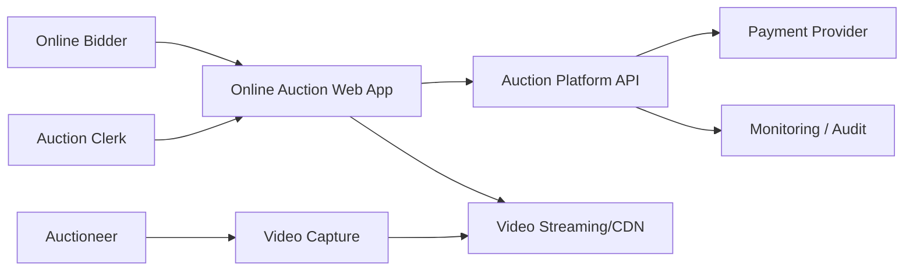
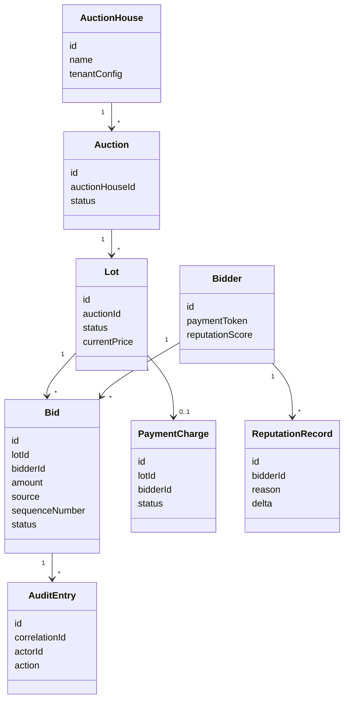
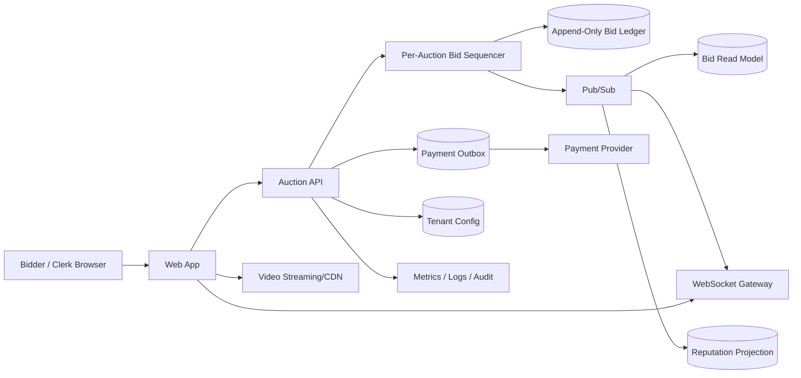
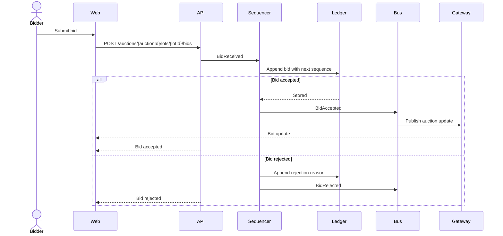
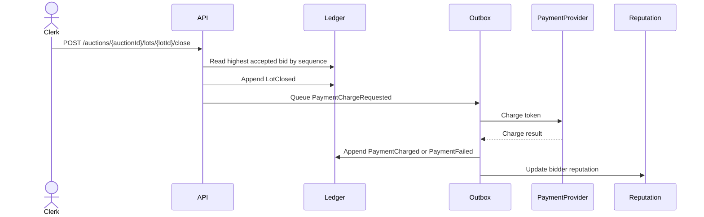

# Online Auctions - Architecture Document

## 1. Introduction

The Online Auctions system lets bidders participate in live auctions nationwide. The architecture optimizes for ordered bid acceptance, low-latency bid visibility, scale, auditability and reliable winner charging.

## 2. Context Diagram

## 3. Architectural Drivers

| Driver | Priority | Design response |
| --- | --- | --- |
| QA-2 Ordering/consistency | Primary | Per-auction sequencer and append-only bid ledger. |
| QA-1 Low latency | Primary | Short bid command path and WebSocket fanout. |
| QA-6 Auditability | Primary | Immutable audit records with correlation IDs. |
| QA-3 Scalability | Primary | Partition active auctions and scale fanout horizontally. |
| QA-5 Security/compliance | Supporting | Tokenized payment provider and payment outbox. |
| QA-4 Availability | Supporting | Video isolated from bid path and recoverable sequencer processing. |
| QA-7 Modifiability | Supporting | Tenant and auction-house configuration. |
| QA-8 Observability | Supporting | Per-auction metrics, logs, traces and alerts. |

## 4. Domain Model

## 5. Container Diagram

## 6. Sequence Diagrams

### Place Bid

### Close Lot And Charge Winner

## 7. Event Definitions

| Event | Producer | Consumer | Payload | Reliability |
| --- | --- | --- | --- | --- |
| BidReceived | Auction API | Bid Sequencer | auctionId, lotId, bidderId, amount, source, correlationId | Durable command queue or sequencer intake. |
| BidAccepted | Bid Sequencer | WebSocket Gateway, Read Model, Audit | bidId, sequenceNumber, amount, bidderId, source | Stored in ledger before publish. |
| BidRejected | Bid Sequencer | WebSocket Gateway, Audit | bidId, reason, sequenceNumber | Stored in ledger before publish. |
| LotClosed | Auction API | Payment Outbox, Read Model | lotId, winningBidId, amount | Stored in ledger. |
| PaymentChargeRequested | Auction API | Payment worker | lotId, bidderId, amount, tokenRef | Stored in outbox and retried. |
| PaymentCharged | Payment worker | Ledger, Reputation Projection | chargeId, lotId, status | Provider result recorded. |
| ReputationUpdated | Reputation Projection | Audit, Web App | bidderId, score, reason | Derived from ledger/payment events. |

## 8. Architectural Decisions

| ID | Driver | Decision | Rationale | Discarded alternatives | Consequences |
| --- | --- | --- | --- | --- | --- |
| ADR-001 | QA-2, QA-6 | Use per-auction bid sequencer and append-only ledger. | One ordered source of truth for online and room bids. | Client timestamps; split bid stores. | Sequencer failover must preserve sequence. |
| ADR-002 | QA-1, QA-3 | Use WebSocket gateway with pub/sub fanout. | Pushes bid updates without overloading command path. | Polling. | Gateway capacity must be load tested. |
| ADR-003 | QA-1, QA-4 | Use managed video streaming/CDN outside bid path. | Video bandwidth and failures do not block bidding. | Self-hosted video in bidding service. | Stream latency is monitored separately from bid latency. |
| ADR-004 | QA-5 | Use tokenized payment provider and payment outbox. | Avoids raw card storage and supports reliable retries. | Store cards; synchronous close-and-charge. | Payment completion can lag lot close. |
| ADR-005 | QA-6, CON-5 | Preserve immutable audit records with correlation IDs. | Supports fraud investigation and dispute review. | Mutable bid status table only. | Audit retention and access must be governed. |
| ADR-006 | QA-7, CON-6 | Use tenant and auction-house configuration boundaries. | Supports acquired auction houses without changing bidding core. | Hard-coded business rules. | Configuration needs validation and review. |

## 9. Interfaces

| Interface | Type | Purpose |
| --- | --- | --- |
| `GET /auctions` | REST query | Browse upcoming and live auctions. |
| `POST /bidders` | REST command | Register bidder and payment token. |
| `POST /auctions/{auctionId}/join` | REST command | Enter live auction room and receive stream/event tokens. |
| `POST /auctions/{auctionId}/lots/{lotId}/bids` | REST command | Submit online bid. |
| `POST /auctions/{auctionId}/lots/{lotId}/live-bids` | REST command | Clerk submits room bid into same ordering path. |
| `WS /auctions/{auctionId}/events` | WebSocket stream | Publish live bid and lot updates. |
| `POST /auctions/{auctionId}/lots/{lotId}/close` | REST command | Close lot, select winner and request payment charge. |
| `GET /participants/{id}/reputation` | REST query | Show reputation index. |

## 10. Scrum Handoff

| Epic/Story | Driver or decision | Acceptance criteria | Architecture check |
| --- | --- | --- | --- |
| Place online bid | QA-1, QA-2, ADR-001 | Accepted bids receive sequence numbers and are visible quickly. | Bid uses sequencer and ledger. |
| Enter live room bid | QA-2, ADR-001 | Room bids use the same accepted-bid ordering as online bids. | No separate live bid store. |
| Publish bid feed | QA-1, QA-3, ADR-002 | Participants receive accepted/rejected bid events in auction order. | WebSocket gateway uses pub/sub. |
| Register bidder payment | QA-5, ADR-004 | Card is tokenized; raw card is not stored. | Payment provider token stored only. |
| Close lot and charge winner | QA-5, ADR-004 | Winning bidder charge is queued and retried on provider failure. | Payment outbox exists. |
| Audit disputed auction | QA-6, ADR-005 | Ordered bids and payment actions can be reconstructed. | Ledger and audit entries have correlation IDs. |
| Onboard auction house | QA-7, ADR-006 | New auction house can configure auctions without code changes to bidding core. | Tenant config path used. |

## 11. Traceability Matrix

| Requirement | Scenario | Driver | Decision | View/diagram | Epic/Story | Check |
| --- | --- | --- | --- | --- | --- | --- |
| OA-5 | QA-1, QA-2 | Low latency, ordering | ADR-001, ADR-002 | Place Bid sequence | Place online bid | Sequenced bid visible through WebSocket. |
| OA-6 | QA-2 | Ordering | ADR-001 | Place Bid sequence | Enter live room bid | Clerk path enters same sequencer. |
| OA-7 | QA-1, QA-3 | Low latency, scalability | ADR-002 | Container | Publish bid feed | Pub/sub fanout load tested. |
| OA-4 | QA-1, QA-4 | Low latency, availability | ADR-003 | Context/Container | Join live auction room | Video isolated from bid path. |
| OA-8 | QA-5 | Security/compliance | ADR-004 | Close Lot sequence | Close lot and charge winner | Payment outbox and token provider used. |
| OA-9 | QA-7 | Modifiability | ADR-006 | Domain model | Update reputation index | Reputation derived from events. |
| OA-10 | QA-6 | Auditability | ADR-005 | Event definitions | Audit disputed auction | Ledger and audit correlation present. |

## 12. Governance Checks

- Critical stories link to at least one driver or decision.
- Online and live room bids must share the same per-auction sequencer.
- Accepted bids must be persisted in an append-only ledger before publication.
- Video streaming must not be in the bid command path.
- Raw credit card data must not be stored by the platform.
- Payment retries must go through the payment outbox.
- Audit records must include correlation IDs.
